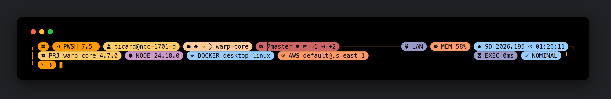

# panel-47

A retro-futuristic control-panel theme for [oh-my-posh](https://ohmyposh.dev), inspired by the ship computer displays of a certain 24th-century starship. Black text on warm color-block pills, connected by rails that frame your terminal like an engineering console.

> This is a fan homage. It is not affiliated with, endorsed by, or sponsored by any studio or rights holder. And yes, the 47 is on purpose.



## Features

- **Full-width panel frame** — rounded corners (`╭ ╮ ╰ ╯`) and colored rails connect every segment across the terminal.
- **Stardate clock** — `SD 2026.195` (year + day of year) next to the regular time.
- **Status board** — a persistent `NOMINAL` pill that flips to a red `ALERT <exit code>` when a command fails; the prompt char turns red too.
- **Path on the input line** — the working directory sits right where you type (`╰─ 󰚝 󰇧 ~  projects  panel-47  ❯`), so the location and the command always read as one line.
- **Space-glyph icon set** — rocket-launch shell, account-star session, star insignia for `SU`/`NOMINAL`, shooting-star execution time, satellite-uplink/antenna network, radar memory, orbit stardate, space-station project, ship-wheel Kubernetes, earth home, and a space shuttle on the prompt char.
- **Detailed git** — branch, upstream icon, ahead/behind, working/staged counts, stash count; the pill turns red when the tree is dirty.
- **Telemetry** — shell + OS, user@host (with SSH indicator), full path, memory usage, battery, network type (LAN/WiFi), Spotify now playing, and last command execution time.
- **Context-aware tech segments** — they only appear when relevant: project name/version, Python (with venv), Node, Go, Rust, Java, Kotlin, .NET, PHP, Ruby, Lua, Dart, Swift, Zig, Elixir, Julia, Perl, CMake, Docker context, Kubernetes context/namespace, Terraform workspace, AWS profile/region, Azure subscription, GCP project, and admin (`SU`) indicator.

## Variants

| Theme | Description |
|---|---|
| [`panel-47.omp.json`](themes/panel-47.omp.json) | The full panel: frame, rails, corners, everything. |
| [`panel-47-classic.omp.json`](themes/panel-47-classic.omp.json) | Same pills and info, no frame — floating segments only. |

## Requirements

- [oh-my-posh](https://ohmyposh.dev/docs/installation/windows) v24+
- A [Nerd Font](https://www.nerdfonts.com/) configured in your terminal (tested with MesloLGM, FiraCode and 0xProto Nerd Fonts)

## Installation

Point your shell init at the theme URL (or download it locally).

**PowerShell** (`$PROFILE`):

```powershell
oh-my-posh init pwsh --config 'https://raw.githubusercontent.com/celiomarcos/panel-47/main/themes/panel-47.omp.json' | Invoke-Expression
```

**bash** (`~/.bashrc`):

```bash
eval "$(oh-my-posh init bash --config 'https://raw.githubusercontent.com/celiomarcos/panel-47/main/themes/panel-47.omp.json')"
```

**zsh** (`~/.zshrc`):

```zsh
eval "$(oh-my-posh init zsh --config 'https://raw.githubusercontent.com/celiomarcos/panel-47/main/themes/panel-47.omp.json')"
```

## Palette

| Color | Hex | Used for |
|---|---|---|
| Orange | `#FF9900` | Frame rails, shell, prompt |
| Gold | `#FFCC66` | Session, project, time-adjacent pills |
| Peach | `#FFCC99` | Path and language pills |
| Salmon | `#FF9966` | Memory, AWS, language pills |
| Lilac | `#CC99CC` | Git (clean), language pills |
| Periwinkle | `#9999CC` | Execution time, network |
| Sky | `#99CCFF` | Clock/stardate, `NOMINAL` |
| Alert red | `#CC6666` | Dirty git, `ALERT`, failed prompt |
| Magenta | `#CC6699` | Spotify |

All pills use black (`#000000`) text, in the style of the original Okudagram panels.

## Customization

- Tech segments fetch real versions; set `fetch_version: false` (or delete segments you never use) for a slightly faster prompt.
- The stardate is `{{ .CurrentDate.Year }}.{{ dayOfYear }}` — tweak the `time` segment template to taste.
- If a glyph renders as a box, your Nerd Font is missing it — swap it in the template for one your font has.

## License

[MIT](LICENSE)
